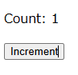

# rollup.jsでReactのビルド環境を作成した後、Viteを導入して開発用サーバーを導入する

## はじめに

既存のWeb環境に後からReactとViteを導入するという状況を想定して開発環境を作成します

* rollup.jsのビルド環境を作り、簡易Webサーバーで動作確認を行う
* Viteを導入して開発用サーバーで動作確認を行う

通常はViteを導入後、必要があればrollup.jsのビルド環境を整えますが順番を逆にします

### ReactでCounterコンポーネントを作成する
```bash
npm i react react-dom
npm i -D @types/react @types/react-dom typescript
```

```json:tsconfig.json
{
  "compilerOptions": {
    "target": "ES2020",
    "useDefineForClassFields": true,
    "lib": ["ES2020", "DOM", "DOM.Iterable"],
    "module": "ESNext",
    "skipLibCheck": true,
    "esModuleInterop": true,

    "moduleResolution": "bundler",
    "resolveJsonModule": true,
    "isolatedModules": true,
    "noEmit": true,
    "jsx": "react-jsx",
    "outDir": "dist"
  },
  "include": ["src"],
}

```

```tsx:Counter.tsx
import React, { useState } from 'react';

type CounterProps = {
  initialCount?: number;
};

const Counter: React.FC<CounterProps> = ({ initialCount = 0 }) => {
  const [count, setCount] = useState(initialCount);

  const increment = () => {
    setCount(count + 1);
  };

  return (
    <div>
      <p>Count: {count}</p>
      <button onClick={increment}>Increment</button>
    </div>
  );
};

export default Counter;

```

```tsx:main.tsx
import ReactDOM from 'react-dom/client';
import Counter from './Counter';

ReactDOM.createRoot(document.getElementById('root')).render(<Counter />);

```

動作確認用html

* `index.html`はviteの開発サーバーがエントリーポイントとして使うため、rollup用に分けて作成する

```html:index-rollup.html
<!DOCTYPE html>
<html lang="ja">
  <head>
    <meta charset="utf-8" />
    <title>React Rollup test</title>
    <script defer src="./dist/bundle.js"></script>
  </head>
  <body>
    <div id="root"></div>
  </body>
</html>

```

### rollup.jsでReactのビルド環境を作成する

```bash
npm i -D rollup tslib @rollup/plugin-typescript @rollup/plugin-commonjs @rollup/plugin-node-resolve @rollup/plugin-replace
```

rollup.config.js

```js:rollup.config.js
import resolve from '@rollup/plugin-node-resolve';
import commonjs from '@rollup/plugin-commonjs';
import replace from '@rollup/plugin-replace';
import typescript from '@rollup/plugin-typescript';

export default {
  input: 'src/main.tsx', // ビルドのエントリーポイント
  output: [
    {
      file: 'dist/bundle.js', // 出力ファイル名
      format: 'esm',
      sourcemap: true,
    },
  ],
  plugins: [
    resolve(),
    commonjs(),
    replace({
      'process.env.NODE_ENV': JSON.stringify(process.env.NODE_ENV),
      preventAssignment: true,
    }),
    typescript({
      tsconfig: 'tsconfig.json',
    }),
  ],
};

```

```json:package.json
  "scripts": {
    "build": "rollup -c"
  },
```

### ビルド＆実行

```bash
$ npm run build
$ npx http-server .
```




## vite環境を導入する

### Viteのインストール

```
npm i -D vite @vitejs/plugin-react
```

### Vite設定ファイルの作成

```js:vite.config.js
import { defineConfig } from 'vite';
import react from '@vitejs/plugin-react';

// https://vitejs.dev/config/
export default defineConfig({
  plugins: [react()],
});

```

package.jsonに開発サーバーを起動するためのスクリプトを追加

```json:package.json
  "scripts": {
    "dev": "vite",
  },
```

viteの開発サーバーから起動するためのファイルを作成する

* 「src=""」は`/`からエントリーポイントとなるファイルのパスを記載する

```html:index.html
<!DOCTYPE html>
<html lang="ja">
  <head>
    <meta charset="utf-8" />
    <title>React Vite test</title>
    <script type="module" src="/src/main.tsx"></script>
  </head>
  <body>
    <div id="root"></div>
  </body>
</html>

```

### 開発サーバーを起動する

```
$npm run dev
$ npm run dev

> rollup-to-vite@1.0.0 dev
> vite


  VITE v6.0.7  ready in 178 ms

  ➜  Local:   http://localhost:5173/
  ➜  Network: use --host to expose
  ➜  press h + enter to show help
```
